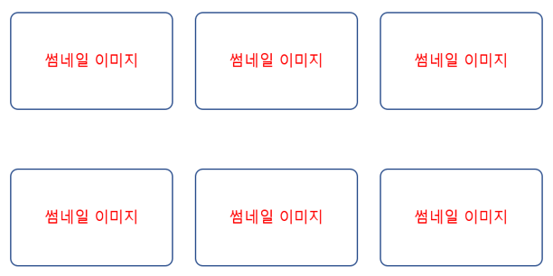

#FE 1-1

###전체 9개의 콘텐츠가 노출되는 페이지를 구성합니다.
###HTML , CSS 를 이용하여 원하는 PAGE 를 구성 할 수 있습니다.
 
1. Youtube 메인 화면과 비슷하게 화면을 구성합니다. 데이터 파일에 보이는 예시 화면과 같이 화면구성을 할 수 있는 기본적인 HTML 을 작성합니다. 
2. 영역을 먼저 정하고 글로만 먼저 나올 수 있게 합니다. ( 썸네일 이미지 1, 썸네일 이미지 2 …) 
3. 텍스트를 이미지로 전환 합니다. 
4. 이미지 위에 마우스가 올라 갔을때 B에서 작성한 텍스트가 노출 될 수 있도록 합니다. 
5. 모든 코드는 파일명을 다르게 하고 git 으로 형상 관리를 진행합니다. 

###개발 환경

Chrome , Safari , 개발자 도구를 탑재하고 있는 브라우저

###제약 조건
한줄에 표현되는 콘텐츠의 개수는 3개 입니다. 3 줄 의 콘텐츠를 출력합니다. (3*3) 
썸네일 이미지 사이즈는 모두 동일한 사이즈로 진행합니다.

###화면 예시

 

###후기
1. lang과 charset
    - HTML 쓴지가 오래되어 \<html lang="ko"> 해주고 '왜 글자가 깨지지?' 하고 있었다..
    - lang은 페이지 속의 텍스트가 어떤 언어로 작성되었는지를 나타내어준다.
      - ko, ko-kr은 VoiceOver 등의 접근성 도구를 사용할 때 사용함.
      - ko-kr은 한국어(한국식)과 같은 의미로 ???.. 싶겠지만 영국식 영어, 캐나다식 영어 등 언어권에선 같은 텍스트라도 다르게 읽힐 수 있다.
    - meta 태그의 charset 속성은 유사하게 작성된 문서의 세부 정보(메타데이터)지만 브라우저에서 해당 데이터를 인코딩하기 위해 필요한 포맷을 나타낸다.
      - 브라우저에 가끔 占쏙옙과 같은 텍스트가 인코딩 규격과 디코딩 규격이 달라 발생하는 것.
      - 0x10과 16, 0b1000의 0x, 0b 처럼 데이터를 원하는 규격으로 표현하기 위해 필요

2. 컨텐츠 배치(layout) - Grid, Flex
   - float을 통해 객체들의 순서와 방향을 만들 수 있었으나, 독립된 객체들의 상호 관련성(높이 차이)이 약해져 flexbox로 진화
   - Flex : 1차원으로 수평, 수직 방향으로 레이아웃 나누기 가능, wrap으로 
   - Grid : 2차원으로 수평, 수직을 동시에 나눌 수 있음
   - 두 값은 display 태그의 값

3. 내부 컨텐츠 내부 정렬
   - div 박스 내부에 텍스트가 있을 시, 매 번 padding으로 위에 50% 이런 식으로 줘서 높이 맞췄었는데 align-items 속성으로 정렬 가능하다 ..
   - justify-contents : 좌우 정렬
   - align-contents : 위아래 정렬

4. objective-fit
   - svg, video, img, object 등 크기가 다양한 객체들이 부모 객체 크기에 맞추어 조정됨.
   - cover : 자주 쓰게 될 것 같음, 종횡비가 유지되며 너비, 높이를 가득 채울 때까지 확대됨