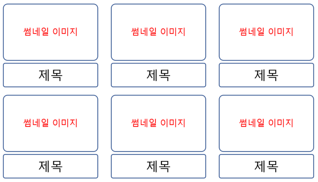

#FE 1-2

###HTML , CSS 를 이용하여 원하는 PAGE 를 구성 할 수 있습니다.
###상세 정보를 입력할 수 있도록 화면을 분할합니다. 1개의 콘텐츠에는 다음 정보를 추가합니다.

1. 대표 이미지를 추가합니다. 썸네일 이미지 영역을 설정하고 ID or Name 값을 추가합니다.
2. 제목 1줄을 추가합니다. 제목 영역을 설정하고 ID or Name 값을 추가합니다.
3. 내용 2줄을 추가합니다. 제목 영역을 설정하고 ID or Name 값을 추가합니다.
4. 작성된 모든 코드는 파일명을 다르게 하고 git으로 형상 관리를 진행합니다.

###개발 환경

Chrome , Safari , 개발자 도구를 탑재하고 있는 브라우저

###제약 조건
1. 9개의 콘텐츠가 모두 이미지, 제목 내용이 추가되어야 합니다.
2. 썸네일 이미지 사이즈는 모두 동일한 사이즈로 진행합니다.
3. 코드에서 모든 영역은 \
\
를 사용하여 분할하고 id or name을 지정합니다.

###화면 예시

###후기
1. id, name, class의 차이점
   - id : 페이지 내 하나의 요소만 지정 가능하며 css selector 사용이 가능
   - name : 페이지 내 여러 요소에 지정 가능하나 css selector 사용이 불가능
   - class : 페이지 내 여러 요소에 지정이 가능하며 selector도 사용 가능
   - name의 경우 css selector에서는 참조할 수 없으나, 객체의 identity를 구분하며 Js에서 참조 가능
2. HTML과 CSS 분리
   - css가 점점 커져서 분리.
   - css 파일을 따로 정의 후 HTML의 link 태그로 불러올 수 있음
   - 현재 코드에서는 rel, href, type 속성을 사용
   - rel은 필수 속성으로 외부 리소스와의 관계를 명시, css의 경우 stylesheet 값을 사용
   - rel 중 preconnect(브라우저에서 대상 리소스에 미리 연결), prefetch(요청 가능성이 있는 리소스로 미리 가져와 캐시)는 알아두어야 할 것 같음
   - href는 외부 리소스의 URL을 작성, 상대, 절대 경로와 CDN 가능
   - type에 text/css 값을 적어줬는데 리소스의 타입을 '명시'하는 것으로 생략해도 링크 되는거 확인함
3. g
   - 1-1에서는 3 * 3 배열을 넘어서는 3 * n 배열일 경우 스크롤이 길어지는 구조를 용이하게 하기 위해 flex 사용
   - 이번에는 컨텐츠가 증가했을 때 3 * 3 배열의 그리드를 고정시키고 페이지네이션을 통해 관리하기 용이하게 grid 구조를 사용해봄
   - grid-templates-column 등의 속성으로 반복되는 컨텐츠들을 관리할 수 있으며, fr 속성을 통해 비율을 계산할 필요 없이 자동화 가능
   - 써보며 느낀 점은 마진 관리가 굉장히 간편함
4. flex
   - 컨텐츠 내부의 이미지와 제목은 flex와 direction을 조절해 아래의 방향을 가지도록 설정