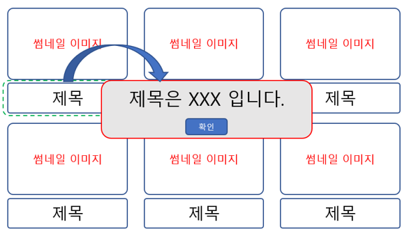

#FE 1-3

###HTML , CSS 를 이용하여 원하는 PAGE 를 구성 할 수 있습니다.
###영상 콘텐츠 메인 화면을 구현합니다.

1. 제목을 클릭시 alert 창에 제목이 나오도록 제작을 합니다.
2. 팝업으로 제목이 나오도록 제작을 합니다. 팝업 페이지는 새로운 파일로 구성되어 있는 하나의 페이지 입니다.
3. 팝업 페이지에는 "닫기" 버튼을 제작합니다. 클릭시 화면을 close합니다.
4. 레이어 팝업으로 제목이 나오도록 제작을 합니다.
5. 모든 코드는 파일명을 다르게 하고 git 으로 형상 관리를 진행합니다. HTML , CSS를 이용하여 원하는 PAGE를 구성 할 수 있습니다. Javascript 를 이용해서 이벤트 컨트롤을 할 수 있습니다. 동일한 형태의 클릭이벤트를 기준으로 하지만 다른 형태의 출력을 하도록 합니다. 하나의 기능을 다양한 형태로 개발이 가능하다는것을 학습 할 수 있습니다.

###개발 환경

Chrome , Safari , 개발자 도구를 탑재하고 있는 브라우저

###제약 조건
클릭시 모든 제목은 클릭된 제목이 나와야 합니다. 
9개 모두 각각의 제목으로 출력되어야 합니다.

###화면 예시

###후기
1. javascript
   - HTML를 통해 문서의 구조를 정의하고, CSS를 통해 디자인을 할 수 있지만 이 둘은 "프로그래밍 언어"가 아니기 때문에 동적인 작업이 불가능
   - 동적인 동작을 위해 ECMA script라는 policy가 사용되며 JavaScript는 해당 표준의 구현체
2. Event
   - 필드의 내용 변경, 클릭, 스크롤 등의 모든 액션을 의미
   - 태그에 onclick 등의 이벤트를 작성하거나, addEventListner를 통해 특정 이벤트에 대한 동작을 설정 가능
3. DOM
   - Document Object Model
     - 문서의 요소들을 객체화해 HTML을 ROOT로 하는 트리 구조로 표현
     - 요소를 선택할 수 있는 선택자(Selector)가 존재(id, class 등)
4. HTML Collector, NodeList
   - getElementsBy~ 와 같은 메서드는 HTML Collection을 반환하는데, 해당 자료구조는 노드 객체의 상태를 실시간으로 반영(선언 시점과 사용 시점의 데이터가 다를 수 있음)
   - querySelector, querySelectorAll 등의 메서드는 노드 객체의 상태 변화를 반영하지 않는 NodeList라는 객체 반환
   - NodeList는 for, foreach 사용 가능하나 다른 ArrayList의 함수는 사용 불가
   - Array로 변환 후 사용이 권장된다함
5. ***script 파일의 import 시점***
    - HTML 태그의 속성으로 onclick을 도배하는 대신, 스크립트를 사용해 반복되는 코드를 줄임.
    - script 파일에서 class가 title인 모든 객체를 불러와 click 이벤트 발생 시 해당 객체의 text 값(제목) 출력하도록 정의
    - 짧은 코드였지만 코드 실행 시점이 head 태그 내에 있어, body 태그가 로드되기 이전에 title 클래스를 찾아 실행되지 않음
    - \</body>와 \</html> 사이로 script 로드 시점을 이동시켜 정상 동작 확인하였으나,
      - body의 일부만 로드
      - script 로드에 시간이 오래걸림
    과 같은 상황에서 객체를 클릭해도 아무 일이 일어나지 않을 수 있다고 생각함
    - 0822 comment
      - 스크립트의 실행은 마지막에 일어나되 스크립트를 미리 로드해 속도를 줄이기 위해 addEventListner('load', ~)를 사용할 수 있겠다는 생각
6. Window
   - 관계 : window.open으로 새로운 창을 열 때, opener라는 super 객체로 연결(호출자)
   - 창을 호출하는 객체(window)에 값을 넣어 호출되는 윈도우에서 해당 값을 사용 가능
   - 처음에 document.write을 통해 값을 변경했으나, html 문서가 해당 단순 text로 덮어씌워지는 코드라고 해서 폐기

