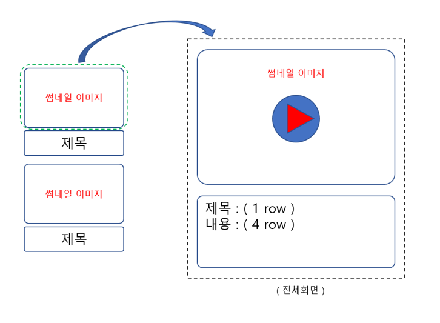

#FE 1-4

###영상 콘텐츠 메인 화면을 구현합니다.  대표 이미지( 썸네일 )를 클릭하면, 상세 페이지로 연결합니다. HTML , CSS 를 이용하여 원하는 PAGE 를 구성 할 수 있습니다.
###Javascript 를 이용해서 이벤트 컨트롤을 할 수 있습니다. 여러 페이지를 이동할 수 있으며, 데이터 이동을 통해 페이지를 재 구성 할 수 있습니다.

1. 상세페이지 제작을 진행 합니다.
2. 페이지 전환 이벤트 처리를 href 로 개발 합니다.
3. 페이지 전환 이벤트 처리를 javascript 에서 개발 합니다.
4. 페이지 전환에 대한 히스토리가 남는경우와 남지 않는 경우에 대해서 조사합니다.
5. 모든 코드는 파일명을 다르게 하고 git 으로 형상 관리를 진행합니다.

###개발 환경

Chrome , Safari , 개발자 도구를 탑재하고 있는 브라우저

###제약 조건
썸네일 이미지 클릭시 상세페이지로 이동합니다.
제목을 클릭시 상세페이지로 이동합니다.

###화면 예시

###후기
1. href와 src
   - href의 경우 사용자가 사용 시 참조가능한 경로를 참조
   - src의 경우 리소스의 위치를 나타내어 렌더링에 필요한 파일의 위치를 나타냄
   - css는 모두 url로 통일하였으며, link의 경우 렌더링에 필요하나 href 사용
2. history.pushstate()
   - 히스토리의 페이지를 그대로 유지하며 주소를 변경
   - 주로 SPA 방식의 어플리케이션이나 페이지네이션의 구현에서 사용
3. 